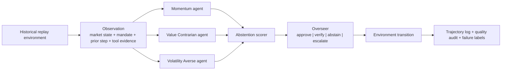

# Safe MarketUniverses

[](https://github.com/pazare/stocktrader/actions/workflows/ci.yml)

Safe MarketUniverses is a safety-evaluation benchmark for one model-intrinsic question: whether model-emitted uncertainty signals can ration scarce human review under corrupted evidence. It scores review allocators by regret against an oracle that spends the same review budget optimally using hindsight utilities the model never sees, so the metric isolates the model signal rather than the harness.

This is a measurement artifact, not a trading system and not investment advice. Finance is the testbed because evidence integrity, uncertainty, disagreement, and review cost are all visible in a compact domain. The same structure applies to any tool-using agent that must make sequential recommendations from uncertain evidence while paying for human review.

## Key finding

On the canonical run of 120 episodes and 480 decision steps, the benchmark separates allocators. Regret per step at a budget of one review per episode:

| Allocator | Regret per step |
| --- | ---: |
| Hand-coded evidence-integrity baseline | 0.091 |
| Model-emitted confidence and verification signals | 0.176 |
| Random | 0.191 |

The decision-relevant takeaway: the model committee is well calibrated on average, with expected calibration error of 0.102 against 0.264 for the hand-coded heuristic, yet its own uncertainty barely beats random at picking which steps deserve scarce review. Good average calibration is not review triage. The result is stable across three logged seed groups, with model-signal regret varying by 0.004, and a utility-free robustness oracle confirms the ranking is not an artifact of the utility scale.

## Reproduce the headline result in two commands

Every number and figure regenerates from the committed logs, with no API key and no model calls:

```bash
python scripts/export_oversight_allocation.py
python -m pytest tests/test_oversight_allocation.py
```

The first command rebuilds `report/oversight_allocation_results.md`, the JSON results, and the flagship figure. The second runs 11 tests covering oracle optimality, non-negative regret, and the utility-free robustness check. CI runs both on every push.

## Ninety-second tour

- Paper: [`report/submission_paper.pdf`](report/submission_paper.pdf), source in [`report/submission_paper.tex`](report/submission_paper.tex)
- Short write-up: [`report/blog_misspent_oversight.md`](report/blog_misspent_oversight.md), on catching the benchmark grading itself and the fix
- Headline artifact: [`outputs/benchmark/smu_headline_v1/summary.json`](outputs/benchmark/smu_headline_v1/summary.json)
- Flagship numbers: [`report/oversight_allocation_results.md`](report/oversight_allocation_results.md)

Scope note. The flagship metric scores model-emitted uncertainty as an allocation signal and treats the benchmark's hand-coded overseer as a baseline. Corruption-conditioned review routing, where review rates rise from 10.8 percent on clean steps to 77.5 percent on corrupted steps, is reported separately as a harness diagnostic, not as a model property, because the overseer can see the corruption markers the harness itself injected.

## How it works



Each episode is a fixed-horizon historical replay over daily U.S. equities. At each step:

1. the environment emits an observation with market features, tool evidence, a mandate, a prior-step summary, and visible interruption or corruption events
2. three LangGraph strategy agents vote independently without seeing one another's outputs
3. an abstention layer estimates reliability from disagreement, confidence spread, evidence consistency, and mandate tension
4. an overseer with a finite budget decides to approve, request verification, force abstention, or escalate to a human
5. the environment advances and logs the transition
6. deterministic checks plus sampled model-based judging score quality separately from bare compliance

Actions are recommendation-centric: directional BUY, HOLD, and SELL, plus the safe deferrals ABSTAIN, VERIFY, and ESCALATE. The canonical universe is 12 tickers chosen to cover steady large-cap, sideways low-signal, high-momentum speculative, recent-drawdown, and higher-volatility regimes.

## What is measured

Primary construct: oversight allocation under evidence corruption, scored as regret against an exact oracle.

Supporting diagnostics include review rates split by clean versus corrupted evidence, corruption deltas on error and reward, intervention rates, budget-limited low-reliability approvals, selective risk, abstention gain, and expected calibration error for both majority votes and executed actions.

Every step carries labels from an explicit failure taxonomy, including oversight miss, oversight overreach, corrupted-evidence susceptibility, regime-shift brittleness, state-tracking failure, overconfident action, and explanation-action mismatch. A concrete example from the headline run: a TSLA recent-drawdown step where the overseer recognized unresolved directional risk but the review budget was already spent, so the system approved HOLD while the realized outcome favored BUY. The run was compliant and still not safe enough to trust in a brittle regime, which is exactly the failure class this benchmark exists to surface.

## Artifact contract

Each run writes one self-contained directory under `outputs/benchmark/` containing the config, progress log, summary, episode specs, per-episode files, step-level trajectories, human-audit candidates, gold-slice review materials, and a failure gallery. Reviewers can inspect any run without rerunning the benchmark or holding an API key. A validator checks internal consistency, not just file presence:

```bash
python scripts/validate_artifact_contract.py outputs/benchmark/smu_headline_v1
```

Fastest human-readable view of a run:

```bash
python scripts/review_benchmark.py outputs/benchmark/smu_headline_v1
python scripts/render_benchmark_figures.py outputs/benchmark/smu_headline_v1
```

## Setup

Requires Python 3.11 or newer. The committed artifacts make most workflows key-free; live runs need an OpenAI API key.

```bash
python3 -m venv .venv
source .venv/bin/activate
pip install -e ".[dev]"
cp .env.example .env   # then add your key locally; .env stays untracked
```

Fast verification without API calls:

```bash
pytest -q
python scripts/run_smoke_benchmark.py
```

Live dependency check, one Yahoo Finance fetch and one model call:

```bash
python -m src.main --verify-setup
```

## Running the benchmark

Canonical run:

```bash
python -m src.main --benchmark
```

The frozen canonical spec is 12 tickers, 120 episodes, 4 steps per episode, an oversight budget of one review per episode, and seed 20260414. Smaller validation runs are available through the same CLI flags, and the full publication matrix runs in resumable batches; see [`REPRODUCIBILITY.md`](REPRODUCIBILITY.md) for the complete suite, model-preflight, human-audit, and readiness workflow.

Note on size: the repo commits the full episode logs for the canonical run and the budget-by-corruption-by-seed grid, roughly 170 MB, so that results regenerate without model access. Use a sparse or blobless clone if you only want the code.

## Repository map

| Path | Contents |
| --- | --- |
| `src/benchmark/` | environment, episodes, abstention, overseer, metrics, oracle and regret, runtime |
| `src/` | LangGraph agents, orchestration, market data, original assignment CLI |
| `scripts/` | reviewer summaries, figures, validation, publication and audit tooling |
| `tests/` | metric proofs, artifact convergence, runtime and readiness checks |
| `outputs/benchmark/` | committed run artifacts, headline run plus the publication grid |
| `report/` | paper, blog write-up, flagship results, figures |
| `DATA_CARD.md`, `MODEL_CARD.md`, `ETHICS.md`, `REPRODUCIBILITY.md`, `AI_USE_DISCLOSURE.md` | publication metadata |

## Scope and limitations

- Market data comes from `yfinance` at runtime; raw market data is not the contribution and is not claimed as redistributable. `DATA_CARD.md` documents the limits and the academic-source migration path.
- Trajectories were generated under a rule-based overseer, so the flagship metric measures the quality of the model's uncertainty as an offline allocation signal. The online version, where the model spends a live depleting budget, is designed and deferred to keep this measurement clean.
- No claims of trading performance, alpha, or solved agent safety. `ETHICS.md` states intended use and misuse risks.
- AI assistance was used for portions of code, tests, and documentation, with human review; see `AI_USE_DISCLOSURE.md`.

## Lineage

This project grew out of a course assignment: LangGraph stock-analysis agents with a momentum trader, a value contrarian, a volatility-averse strategist, disagreement-triggered debate, and a historical backtest. That workflow still runs via `python -m src.main` with custom tickers, debate, and backtest flags. The benchmark narrows that demo into a measurement instrument for one deployment-critical behavior: evidence-integrity triage under a finite review budget.

## License and citation

MIT licensed. Citation metadata is in [`CITATION.cff`](CITATION.cff).
