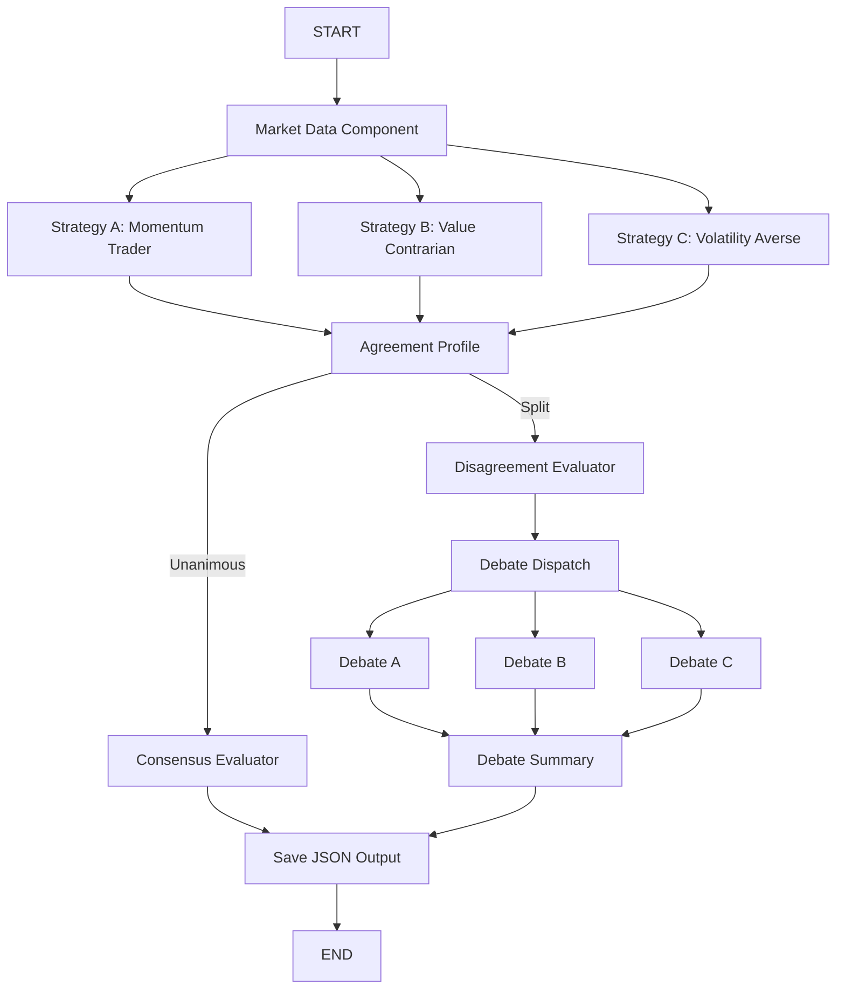

# Comparative Analysis Report

## 1. Strategy Selection and Rationale

### 1.1 Core Pair

The core analytical comparison in this project is `Momentum Trader` versus `Value Contrarian`.

I selected this pair because it creates a direct philosophical clash while keeping the market input fixed. Both strategies receive the same stock snapshot, but they rank the evidence differently:

- the `Momentum Trader` rewards confirmation, continuation, and trend persistence
- the `Value Contrarian` treats recent price moves more skeptically and looks for overreaction, discount, or overvaluation

This also matches the intended analytical lens for the project:

- `(1)` valuation pressure through `trailing_pe`
- `(2)` trend pressure through short-term versus long-term moving averages

Expected disagreements before the run:

- a stock with strong recent momentum but a rich valuation may attract `BUY` from momentum and `HOLD` or `SELL` from the contrarian
- a stock in a deep drawdown may attract `SELL` from momentum and `BUY` or `HOLD` from the contrarian
- a stock with mixed or low-conviction signals may push both toward `HOLD`

### 1.2 Third Strategy Extension

For the optional third-agent extension, I added `Volatility Averse`.

This strategy is meaningfully different from the other two rather than being a cosmetic prompt variation. Its center of gravity is:

- realized volatility
- average true range
- max single-day drop
- whether price behavior is stable enough to justify exposure at all

This matters because a stock can look attractive under momentum logic or contrarian logic and still be rejected on risk grounds.

## 2. System Architecture

### 2.1 Base Assignment Logic

The original assignment requires:

- one market-data component with zero LLM calls
- independent strategy branches
- an evaluator that distinguishes agreement from disagreement
- JSON output saved per stock

### 2.2 Extended Workflow Implemented

The implemented workflow satisfies the base assignment and adds all three bonus extensions:

The concrete implementation is spread across:

- workflow orchestration: `src/orchestration.py`
- market-data computation: `src/market_data.py`
- strategy prompts and execution: `src/strategy_agents.py`
- evaluator logic: `src/evaluator.py`
- historical backtest: `src/backtest.py`

### 2.3 Why LangGraph Is a Good Fit

LangGraph is appropriate here because this project is really about controlled orchestration, not free-form agent autonomy. The documentation shows the `StateGraph` pattern with `START` and `END`, and the Graph API explains:

- fixed edges for deterministic routing
- conditional edges for runtime branching
- parallel fan-out from one node to multiple downstream nodes

That maps directly to this implementation:

- one shared `market_data` node
- three independent first-round strategy nodes
- one agreement-profile node that summarizes the split pattern
- one evaluator stage
- a disagreement-only second-round debate branch

The system also stays efficient because each parallel branch writes to a distinct state key. That avoids reducer complexity and keeps branch ownership explicit:

- `strategy_a`
- `strategy_b`
- `strategy_c`
- `debate_a`
- `debate_b`
- `debate_c`

## 3. Market Data Logic

### 3.1 Data Acquisition

The market-data pipeline uses `yfinance.download(...)` for daily OHLCV history and uses `Ticker.info` only for live metadata and valuation context during the forward run.

This separation is deliberate:

- price history is what the technical indicators actually depend on
- live metadata is best-effort and may be missing
- historical backtest snapshots must not reuse current `trailing_pe`, because that would create lookahead bias

### 3.2 Indicators Used

The market-data component computes a compact set of indicators that map directly to the three behavioral lenses. Momentum Trader emphasizes moving-average structure, recent returns, and volume confirmation. Value Contrarian emphasizes trailing P/E, RSI, drawdown, and distance from the 52-week range. Volatility Averse emphasizes realized volatility, ATR, and max one-day drop. This keeps the feature set aligned to the strategy philosophies instead of collecting indicators for their own sake.

### 3.3 Why Historical Valuation Is Omitted in Backtest Mode

The backtest extension uses historical price snapshots but intentionally omits `trailing_pe` from those historical snapshots. This is a rigor choice rather than a missing feature. `yfinance.info` exposes current metadata, not reliable historical valuation snapshots at each past checkpoint. Using today’s valuation field inside a historical simulation would leak future knowledge backward into the test.

As a result:

- the backtest remains more honest
- the contrarian strategy still functions because its prompt is already designed to fall back to RSI, drawdown, and range cues when valuation is missing

## 4. Stock Selection and Rationale

The final stock basket was selected from live market-only checks performed on April 11, 2026, using the latest available trading data from April 10, 2026. I initially tested `NVDA` as a fifth live stock, but it collapsed into another three-way `HOLD` and did not improve the disagreement evidence. I replaced it with `TSLA`, which produced a richer and more analytically useful split.

| Ticker | Role | Evidence from live market-only data |
| --- | --- | --- |
| `COST` | steady established large-cap | `pct_change_30d = 1.19`, `short_vs_long_ma_pct = 0.27`, `atr_pct_of_price = 1.9` |
| `HIMS` | volatile recent momentum case | `pct_change_30d = 24.55`, `short_vs_long_ma_pct = 5.68`, `volatility_30d = 0.0941` |
| `SMCI` | sharp decline case | `pct_change_30d = -21.75`, `short_vs_long_ma_pct = -14.31`, `pct_from_52w_high = -58.39` |
| `JNJ` | sideways / lower-conviction case | `pct_change_30d = -2.06`, `short_vs_long_ma_pct = -0.32`, `rsi_14 = 46.31` |
| `TSLA` | disagreement-rich speculative mega-cap | `pct_change_30d = -14.59`, `short_vs_long_ma_pct = -5.95`, `trailing_pe = 323.1` |

Why this basket is analytically useful:

- `COST` can expose stability versus valuation tension
- `HIMS` can expose momentum versus volatility tension
- `SMCI` can expose contrarian temptation versus trend deterioration
- `JNJ` can expose low-conviction agreement or mild disagreement
- `TSLA` can expose the case where negative trend and expensive valuation align, but the risk-first lens still refuses an aggressive directional call

The actual run confirmed that the final basket was both valid and meaningfully more revealing than the first conservative pass. It produced:

- two unanimous `HOLD` outcomes
- three `two_vs_one_split` outcomes
- three debate-triggered cases
- one post-debate position change
- no `three_way_split`

That means the basket not only satisfied the assignment requirement of showing both agreement and disagreement, but also surfaced multiple types of disagreement. It also reinforced an important lesson: stock selection is highly date-sensitive, and the strongest submission comes from iterating on the basket honestly rather than accepting a weak first pass.

## 5. Results by Stock

### 5.1 Summary Table

| Ticker | Momentum | Value Contrarian | Volatility Averse | Agreement type | Debate triggered? | Key evaluator takeaway |
| --- | --- | --- | --- | --- | --- | --- |
| `COST` | `BUY (7)` | `HOLD (7)` | `HOLD (8)` | `two_vs_one_split` | `Yes` | Momentum initially treated the stable uptrend as actionable, but debate pulled it back to HOLD consensus. |
| `HIMS` | `HOLD (7)` | `HOLD (7)` | `HOLD (8)` | `unanimous` | `No` | Short-term rebound existed, but long-term damage and high volatility overrode the bullish case. |
| `SMCI` | `SELL (9)` | `HOLD (7)` | `HOLD (9)` | `two_vs_one_split` | `Yes` | Momentum treated the breakdown as actionable, while the other two saw weakness without full capitulation. |
| `JNJ` | `HOLD (7)` | `HOLD (7)` | `HOLD (8)` | `unanimous` | `No` | Mild short-term weakness inside a still-stable long-term regime produced low-conviction agreement. |
| `TSLA` | `SELL (9)` | `SELL (8)` | `HOLD (8)` | `two_vs_one_split` | `Yes` | Momentum and value both saw downside risk, while the volatility-first lens refused to short unstable weakness. |

### 5.2 Per-Stock Results

#### `COST`

- First-round outputs: Momentum Trader gave `BUY (7)`, while Value Contrarian and Volatility Averse both gave `HOLD` (`7` and `8`). Momentum leaned on price above the 20-day, 50-day, and 200-day moving averages plus `1.26x` average volume, while the other two emphasized the rich `51.81` trailing P/E, neutral `50.2` RSI, and the fact that the 30-day move was only `+1.19%`.
- Evaluator and interpretation: This became the best debate case in the project. The initial disagreement was real, but the second round improved the system because the Momentum Trader revised from `BUY` to `HOLD`, producing post-debate unanimity instead of preserving a weak bullish call.

#### `HIMS`

- First-round outputs: all three strategies landed on `HOLD`, with confidence scores of `7`, `7`, and `8`. The shared logic was that a `24.55%` 30-day rebound was real, but weak volume at only `0.42x` average, a price still far below the 200-day moving average (`38.93`), and elevated volatility (`0.0941` over 30 days) kept the setup from becoming a buy.
- Evaluator and interpretation: HIMS is the cleanest agreement case showing that recent upside alone is not enough. The system correctly treated it as a rebound inside a still-damaged regime rather than as a fresh bullish trend.

#### `SMCI`

- First-round outputs: Momentum Trader gave `SELL (9)`, while Value Contrarian and Volatility Averse both gave `HOLD` (`7` and `9`). The disagreement centered on whether the breakdown was already actionable: momentum emphasized the `-21.75%` 30-day move and `-14.31%` moving-average spread, while the other two emphasized neutral RSI (`48.68`), only modestly above-average volume (`1.06x`), and the lack of a true capitulation signal.
- Evaluator and interpretation: SMCI is the clearest classic philosophy split in the project. The same facts supported either decisive bearishness or disciplined patience depending on whether trend deterioration itself counted as sufficient evidence.

#### `JNJ`

- First-round outputs: all three strategies landed on `HOLD`, with confidence scores of `7`, `7`, and `8`. Mild short-term weakness (`-2.06%` over 30 days) and a slightly soft RSI (`46.31`) were offset by low volatility and a long-term trend that was still intact above the 200-day moving average.
- Evaluator and interpretation: JNJ is the cleanest “balanced, low-urgency” case. It shows that agreement can emerge from moderation, not just from clearly bullish or bearish conditions.

#### `TSLA`

- First-round outputs: Momentum Trader gave `SELL (9)`, Value Contrarian also gave `SELL (8)`, and Volatility Averse gave `HOLD (8)`. Momentum focused on the broken trend, while the contrarian agent turned bearish for a different reason: a trailing P/E of `323.1` on top of a `-14.59%` 30-day decline and prices below all major moving averages.
- Evaluator and interpretation: TSLA is the most interesting coalition case in the report. It shows that disagreement is not always momentum versus value; sometimes valuation and trend align on the same bearish conclusion while the risk-first lens becomes the sole dissenter.

### 5.3 Required Direct Excerpts

The following are quoted verbatim from pre-generated JSON output files in the `outputs/` directory.

**Excerpt 1 — `outputs/TSLA.json`, `evaluator.analysis` (two-vs-one disagreement case):**

> “The two SELL strategies aligned because they both treated TSLA's price structure as the dominant signal: the stock is at 348.95, below the 20-day (370.85), 50-day (394.31), and 200-day (397.35) averages, with a -14.59% 30-day decline and a -5.95% short-vs-long MA spread, which strongly supports continued downside or at least no sign of recovery. Strategy A emphasized momentum confirmation, noting volume is only 0.8x the 30-day average and RSI at 37.11 is weak but not oversold enough to justify a rebound call, while Strategy B added a valuation overlay, arguing that a trailing P/E of 323.1 offers no cushion against the same technical weakness. The HOLD strategy diverged by prioritizing regime uncertainty over outright bearishness: it agreed the trend is poor and ATR is elevated at 15.43 (4.42% of price), but saw RSI 37.11, 90-day volatility of 0.0232, and a large 28.77% drawdown from the 52-week high as insufficient for a clean reversal or low-volatility entry. In short, the split came from two agents seeing the same bearish trend as actionable downside, while the third saw enough weakness and instability to avoid taking a directional bet rather than shorting it.”

This excerpt demonstrates what a strong evaluator output looks like: it identifies the specific evidence each agent prioritized, explains why two independent frameworks reached the same SELL from different directions, and shows precisely why the third framework stopped short of agreeing despite sharing the same negative read on the trend.

**Excerpt 2 — `outputs/COST.json`, `debate.participants.strategy_a.response_to_peers` (debate position-change case):**

> “I'm revising my initial BUY to HOLD because the peer arguments correctly highlighted that the momentum is constructive but not strong enough to justify conviction. COST is only 1.19% above its price 30 days ago and just 0.27% above the 20-day moving average at 995.42, so the short-term trend is positive but barely so; that is not the kind of clean acceleration I want for a momentum buy. The longer-term structure remains intact with the 50-day at 992.70 and 200-day at 949.17, and volume at 2,331,500 is 1.26x the 30-day average, which keeps me from turning bearish. However, with RSI at 50.2, a 90-day drawdown of -3.25%, and the stock still 5.52% below the 52-week high of 1,056.85, the setup looks more like a steady hold than an actionable breakout.”

This excerpt is the clearest example of debate producing genuine revision rather than mere reinforcement. The Momentum Trader did not simply repeat its initial reasoning; it re-weighted specific numbers — 0.27% above the 20-day average, 5.52% below the 52-week high — against the peer lenses and downgraded its call. The post-debate agreement profile for COST shifted from `two_vs_one_split` to `unanimous`, confirming that the revision was substantive.

## 6. Debate Mode Extension

This extension activates only when the first-round results disagree. Each strategy receives:

- the original market snapshot
- its own first-round output
- the peer strategies’ first-round outputs

Each strategy can either:

- keep its original position and defend it
- revise its decision
- keep the decision but revise confidence

### 6.1 Debate Summary

The debate extension triggered for three stocks: `COST`, `SMCI`, and `TSLA`.

- Stocks with debate: `3` (`COST`, `SMCI`, `TSLA`)
- Stocks with any position change: `1`
- Strongest debate case: `COST`, because the Momentum Trader revised from `BUY` to `HOLD`, moving the post-debate profile from a `two_vs_one_split` to unanimous agreement
- Did debate move the system toward consensus, or mostly reinforce prior beliefs? It did both. `COST` moved toward consensus, while `SMCI` and `TSLA` mostly reinforced prior beliefs but still produced useful second-round defenses and, in `TSLA`, a confidence reduction for the Volatility Averse agent.

This is the kind of debate behavior worth keeping. It does not force artificial convergence on every disagreement, but it can still reveal when a position is only weakly held and should be softened after peer critique.

## 7. Patterns of Agreement and Disagreement

The aggregate counts in `summary.json` were much stronger after refining the basket: `2` agreements, `3` disagreements, `3` two-vs-one splits, `0` three-way splits, and `3` debate triggers with `1` post-debate position change. This is a much better analytical distribution than the earlier conservative pass because it shows both convergence and repeated, explainable divergence without making the system look erratic.

The most interesting two-vs-one split was `TSLA`, because it showed a different coalition than `SMCI`. In `TSLA`, both Momentum Trader and Value Contrarian landed on `SELL`, but for different reasons: momentum emphasized the broken trend, while the contrarian emphasized the extremely rich `323.1` trailing P/E layered on top of that same weakness. Volatility Averse dissented with `HOLD`, not because it liked the stock, but because it refused to make an aggressive bearish call in a still-unstable regime.

`COST` and `SMCI` revealed a second pattern. In both cases the Momentum Trader was the outlier, but in opposite directions: `BUY` for a steady uptrend in COST and `SELL` for a damaged breakdown in SMCI. That tells us the momentum lens is the most decisive of the three, while the value and risk lenses are more selective about when price action alone is enough to justify action.

A structural regularity underlies both patterns and explains the unanimous cases with equal precision. In this sample, price relative to the 200-day moving average operated as an asymmetric regime gate: every stock above the 200-day produced only HOLD or BUY outcomes; every stock below it produced only HOLD or SELL. For JNJ (price 238.46 vs. 200-day MA 200.63, mid-vs-long spread +19.95%) and COST (998.47 vs. 949.17), the intact long-term structure rendered SELL unavailable to all three agents regardless of short-term softness. For HIMS (50.1% below the 200-day), SMCI (35.9% below), and TSLA (12.2% below), BUY was equivalently foreclosed. Within each constrained zone, the question reduces to whether a directional signal is strong enough to move any agent beyond HOLD: no signal cleared the BUY threshold in JNJ, and none cleared the SELL threshold in HIMS — the 24.55% rebound was real but insufficient against a 50.1% structural deficit. SMCI and TSLA split because their directional SELL signals were strong enough to cross that threshold from below: trend severity alone in SMCI, the compounding of trend breakdown and a 323.1 trailing P/E in TSLA, each sufficient for the Momentum Trader and, in TSLA's case, for the Value Contrarian as well, while the Volatility Averse agent held in both. The disagreements are not episodes of randomness; they are threshold crossings within a regime-bounded decision space. The confidence scores corroborate this reading by functioning as epistemological signatures rather than simple measures of belief intensity. The Volatility Averse agent never fell below 8 across all five stocks, because its question — whether price action is empirically stable — admits high-certainty answers in nearly any market state regardless of direction. The Momentum Trader escalated to 9 exclusively on unambiguous downtrends (SMCI, TSLA) and held at 7 in every ambiguous case, with confidence tracking trend clarity directly rather than general conviction. The Value Contrarian never exceeded 8, consistent with the structural epistemic caution its prompt explicitly encodes: trailing P/E and range-distance are noisier evidence than price action, and the ceiling on conviction is built into the strategy's design.

There was still no three-way split, and that absence is informative rather than disappointing. The market conditions in this sample were varied enough to generate multiple disagreements, but not chaotic enough to push all three philosophies into completely separate camps. The resulting pattern suggests a market environment with several names near inflection points: stable quality stocks that are not cheap enough to buy aggressively, damaged growth stocks that are not clean bargains yet, and speculative names where valuation and trend can align against the stock even while a risk-first lens stays cautious.

## 8. Historical Backtest Extension

### 8.1 Methodology

The backtest extension evaluates historical checkpoints using saved market snapshots and realized forward returns.

Default methodology in the code:

- `3` checkpoints per stock
- `20` forward trading days
- `3.0%` hold band

Outcome mapping:

- forward return above `+3.0%` => realized `BUY`
- forward return below `-3.0%` => realized `SELL`
- otherwise => realized `HOLD`

The scorecard captures two different views of performance:

- exact-match accuracy against the realized label
- average simulated return if the recommendation had been followed directionally

### 8.2 Backtest Table

| Strategy | Exact-match accuracy | Average simulated return | Interpretation |
| --- | --- | --- | --- |
| Momentum Trader | `20.0%` | `-1.20%` | Directionally useful when trends persist, but still vulnerable to reversals and false continuation. |
| Value Contrarian | `26.7%` | `3.21%` | Best overall balance in this run; it was not the most accurate by a wide margin, but it generated the best directional return profile. |
| Volatility Averse | `26.7%` | `-3.34%` | Matched Value Contrarian on label accuracy, but its defensive stance still missed profitable rebounds and left returns worse. |

The backtest scorecard again produced a useful tension between two metrics. `Value Contrarian` and `Volatility Averse` tied for the best exact-match accuracy at `26.7%`, but only `Value Contrarian` produced a positive average simulated return at `3.21%`.

This matters because exact label accuracy and directional usefulness are not the same thing. A strategy can match many `HOLD` labels and still miss the most economically important moves. In this run, the volatility-first lens was best at avoiding overtrading in classification terms, but when it did lean wrong it was punished more severely.

The backtest both supported and challenged the live-run conclusions. It supported the idea that the system’s strategies were genuinely different, because they produced meaningfully different score patterns. But it challenged any simplistic reading that the most cautious strategy is automatically best. The live run made the agents look prudent and thoughtful; the backtest showed that prudence alone was not enough to avoid costly misses.

## 9. Failure or Surprise Case

- Stock: `HIMS` historical checkpoint on `2026-02-10`
- What happened: At that checkpoint, HIMS was at its 52-week low (`17.24`), down `49.75%` over 30 days with RSI at `16.09` and volume at `2.05x` average. The Momentum Trader issued `SELL` with confidence `10`, the Volatility Averse agent issued `SELL` with confidence `9`, and the Value Contrarian still only issued `HOLD`. Over the next 20 trading days, the realized forward return was `+50.12%`, which mapped to a realized `BUY`.
- Why it matters: This was the clearest failure case in the entire project. It exposed how trend-following and risk-avoidance can both misread a capitulation bottom as continued deterioration, while the contrarian prompt remained too cautious to exploit the reversal.
- Likely cause: Historical valuation data was intentionally omitted to avoid lookahead bias, so the contrarian agent lacked a full valuation anchor. More broadly, all three prompts were better at handling ordinary mixed signals than at recognizing exhaustion events with extreme downside stretch and rebound potential.
- Improvement for next iteration: Add an explicit capitulation-reversal rule that lowers confidence in `SELL` when RSI is extremely depressed, price is at or near a 52-week low, and volume spikes far above average. For the contrarian agent, a second rule could permit a small, low-confidence `BUY` when those same features cluster together.

## 10. Reflection

### 10.1 Personal Choice

If I had to allocate a hypothetical `$10,000` for the next month, I would follow the `Value Contrarian` strategy. In this project it produced the best average simulated return in the backtest (`3.21%`) while also behaving sensibly in the live run by refusing to chase weak rebounds or overreact to modest pullbacks. For a short one-month horizon, that balance between skepticism and patience looked more robust than pure momentum or pure risk aversion.

### 10.2 Hybrid Strategy Idea

A stronger hybrid could:

- require positive moving-average confirmation before aggressive buying
- use RSI and drawdown to avoid chasing obvious overextension
- use volatility as a conviction or position-sizing modifier
- treat P/E as context rather than a standalone trigger when valuation history is unavailable

In practice, I would implement the hybrid as a gated process:

1. start with trend regime, using the 20-day versus 50-day and 200-day moving averages
2. check whether RSI, drawdown, and 52-week range location suggest overextension or capitulation
3. reduce confidence when volatility, ATR, or max one-day drop indicate unstable tape
4. use valuation only as a confirming layer when reliable live data exists

That hybrid would preserve the strongest lesson from this project: the best decisions came from combining signal classes, not from letting any single philosophy dominate every market condition.

## 11. Documentation References

These references shaped the implementation:

- OpenAI Structured Outputs guide: [Structured outputs](https://platform.openai.com/docs/guides/structured-outputs?api-mode=responses&lang=python)
- OpenAI Responses API reference: [Responses API](https://platform.openai.com/docs/api-reference/responses)
- LangGraph overview: [LangGraph overview](https://docs.langchain.com/oss/python/langgraph)
- LangGraph Graph API guide: [Use the graph API](https://docs.langchain.com/oss/python/langgraph/use-graph-api)
- yfinance README: [yfinance README](https://github.com/ranaroussi/yfinance)
